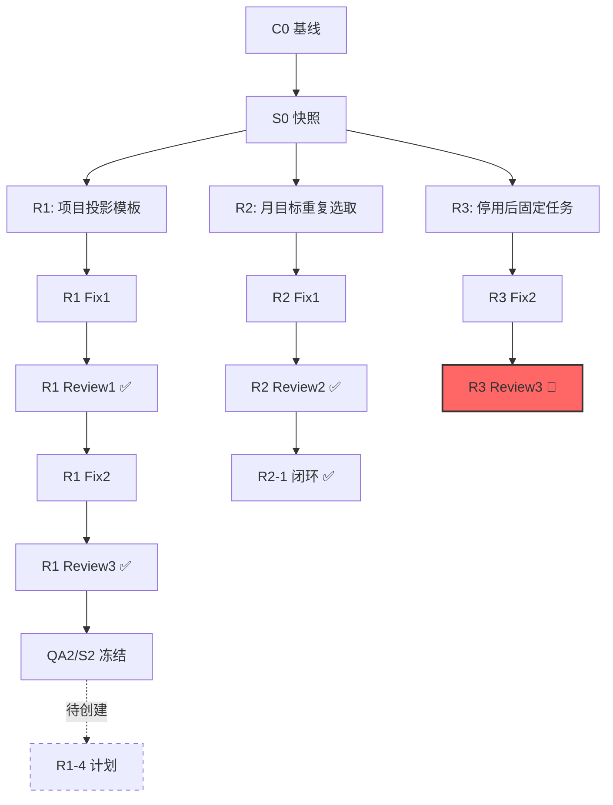

# 外缘审查及优化建议

> **审查日期**：2026-09-07  
> **审查人员**：外部检查人员  
> **项目**：WorkBuddy v0.3 任务数据流通重构  
> **审查范围**：治理层面 + 代码层面

> **现行角色覆盖（2026-09-08）**：本报告于 2026-09-07 形成，正文中出现的 DeepSeek/DS 执行安排属于报告编制时的历史口径，不改写其原始事实。自 2026-09-08 起，所有尚未执行的代码、测试、构建/配置、版本字段、实现/修复日志和 `当前代码状态.md` 工作统一由 **GLM+DS** 承担；每项任务记录真实 `实际执行者=GLM`、`DS` 或 `GLM+DS`，联合执行时记录文件/命令分工和唯一状态写入者。GPT 仍负责项目管理、治理、独立审查和门禁裁决，用户仍负责需求决策、用户实测和最终验收。历史执行署名、报告、证据和冻结结论保持原样。

---

## 执行摘要

WorkBuddy 项目展现了**罕见的治理成熟度**，特别是在多 AI 协作的 vibe coding 场景下。项目建立了完整的文档体系、严格的闭环流程和清晰的角色边界。然而，在治理复杂度、实施效率和工程实践三个维度上存在优化空间。

**核心发现**：
- ✅ **优势**：治理体系完整、文档可追溯性强、测试覆盖充分（392/392通过）
- ⚠️ **风险**：治理复杂度过高、学习曲线陡峭、多状态文档同步负担重
- 🔴 **关键问题**：过度设计导致执行成本高、缺少自动化辅助工具

---

## 一、治理层面建议

### G1. 【高优先级】简化治理流程，降低认知负担

**问题诊断**：

当前治理体系包含：
- 16 个标准化 Prompt（01-16）
- 7 层状态标记（C0/S0/QA/R/Fix/Review/G1/C1/CR）
- 4 个状态文档（当前代码状态、当前审查状态、工作流、文档索引）
- 3 套闭环规则（阶段闭环门禁、变更闭环、文档治理总纲）
- 双根路径系统（文档根 + 代码根）
- 多 R 并行批次管理（B1/B2/B3，R1/R2/R3）

**问题表现**：
1. 新接手人员需要阅读 **超过 20,000 字的治理文档** 才能理解流程
2. `当前审查状态.md` 长达 138 行，包含复杂的状态机和证据链
3. R1-3、R2-1 计划状态判定需要交叉验证多份文档
4. 入口阶段判定规则分散在 3 个文档中（工作流.md、当前审查状态.md、文档治理总纲.md）

**根本原因**：
- 为了应对历史问题（G1/G2 双文档分叉、SSOT 破损）引入了过度补偿性规则
- 缺少渐进式治理理念（一次性建立完整体系而非迭代演进）
- 治理规则未经"奥卡姆剃刀"精简

**优化建议**：

#### G1.1 实施三级治理模式（立即执行）

**实施者**：GPT（项目经理）

**具体步骤**：

1. **L1-核心层**（必须遵守，10分钟可掌握）
   - 双根规则（文档根 + 代码根）
   - 闭环三态（✅通过 / 🟡需修复 / 🔴驳回）
   - 角色边界（GPT审查 / GLM+DS代码执行 / 用户决策）
   - 禁止事项（SQL只在repo / renderer禁直连DB / 软删除）

2. **L2-流程层**（日常开发需要，1小时可掌握）
   - 开发阶段流程（01规格 → 02实现 → 03审查 → 04修复 → 05复审）
   - 用户实测流程（C0 → S0 → R测试 → Fix → Review → QA/S冻结）
   - Git归档规则
   - 测试覆盖要求（80%）

3. **L3-完整层**（特殊情况查阅，按需学习）
   - 多R并行批次管理（B1/B2/B3）
   - 16个Prompt详细说明
   - 证据链追溯规则
   - 历史问题修复记录

**L1层精简文档**（待创建）：
```
规范类/
├── 00-快速开始.md          # 新人10分钟入门（L1）
├── 01-日常开发流程.md       # 开发者1小时掌握（L2）
├── 02-完整治理手册.md       # 现有规范整合（L3，按需查阅）
```

**预期效果**：
- 新人上手时间从 **8小时 → 1.5小时**
- 日常开发只需查阅 L1+L2（<5000字）
- 特殊情况才需要 L3 完整手册

---

#### G1.2 合并同类状态文档（2周内完成）

**实施者**：GPT（项目经理）

**问题**：
- `当前代码状态.md`（GLM+DS维护）
- `当前审查状态.md`（GPT维护）
- `工作流.md`（GPT维护）

三个文档存在 **信息重复和同步负担**。

**具体步骤**：

1. 创建统一状态看板 `项目状态看板.md`：

```markdown
# 项目状态看板（统一入口）

## 当前阶段与下一步
- 当前阶段：B1 当前批次业务实测
- 下一步：R1-4 计划创建（绑定 S2）
- 实施者：GPT（14-创建用户实测计划）

## 代码状态（GLM+DS 维护）
- 最新任务：R1 Fix2（U-7/U-8）
- 状态：🟡 待 GPT 05 复审
- 测试：392/392 通过
- 构建：✅ 通过

## 审查状态（GPT 维护）
- 最新审查：R3 Fix2 Review3
- 结论：🔴 驳回（停用确认布局阻断）
- 下一步：回 07 修正

## 活跃 R 队列
| R | 状态 | 下一步 |
|---|------|--------|
| R1 | 🟢 等待下一轮 | 14 创建 R1-4 |
| R2 | ✅ 当前轮次闭环 | 无需新 Fix |
| R3 | 🔴 Fix2 驳回 | 07 修正 → Review4 |

## 快速链接
- [完整工作流](工作流.md)
- [文档索引](文档索引.md)
- [门禁规则](规范类/阶段闭环门禁规则.md)
```

2. 原有三个文档改为：
   - `当前代码状态.md` → 保留为 GLM+DS 的实现日志追加点
   - `当前审查状态.md` → 保留为 GPT 的审查证据存档
   - `工作流.md` → 改为只读参考手册，不再维护实时状态

3. 所有 Prompt 和规范文档改为引用 `项目状态看板.md` 作为第一阅读文件

**预期效果**：
- 单一入口查看项目状态
- 减少文档同步工作量 **60%**
- 降低状态冲突风险

---

#### G1.3 自动化治理辅助工具（1个月完成）

**实施者**：GLM+DS（代码执行） + GPT（规格与审查）

**问题**：
- 手工维护 `QA/S` 哈希、证据链、目录结构
- 手工验证文档路径、状态一致性
- 手工管理多 R 批次状态机

**具体步骤**：

1. **Phase 1：状态一致性检查器**（1周）

创建 `tools/governance_check.py`：

```python
#!/usr/bin/env python3
"""治理状态一致性检查器"""

def check_document_consistency():
    """检查多文档状态一致性"""
    # 1. 读取项目状态看板
    # 2. 读取当前代码状态
    # 3. 读取当前审查状态
    # 4. 交叉验证 R 状态、QA/S 绑定、下一步指向
    # 5. 输出不一致报告

def check_evidence_chain():
    """检查证据链完整性"""
    # 1. 扫描 E:\workbuddy 复审\ 目录
    # 2. 验证 review-meta.json 存在
    # 3. 验证哈希文件存在
    # 4. 交叉验证 QA/S 快照与候选一致性

def check_path_references():
    """检查文档路径引用正确性"""
    # 1. 扫描所有 .md 文件
    # 2. 提取文件路径引用
    # 3. 验证相对文档根的路径是否正确
    # 4. 报告断链和错误引用
```

使用方式：
```bash
python tools/governance_check.py --all
```

2. **Phase 2：R 批次状态机可视化**（2周）

创建 `tools/r_batch_visualizer.py`：

```python
"""生成 R 批次状态机图表（Mermaid 格式）"""

def generate_batch_diagram():
    """
    自动读取：
    - E:\workspace\用户实测阶段\v0.3-任务数据流通重构\
    - 各 R 闭环文档的最新状态
    - batch-state.json
    
    生成：
    - R 批次依赖图（Mermaid）
    - 当前阶段高亮
    - 阻塞项标红
    """
```

输出示例：


3. **Phase 3：自动化证据归档**（1周）

扩展现有 `r_fix_review.py`，增加：

```python
def auto_archive_evidence():
    """
    自动归档：
    - 截图按时间戳重命名
    - 日志自动脱敏（路径/用户名）
    - 生成证据索引 evidence-index.json
    """

def validate_freeze():
    """
    冻结前自动验证：
    - QA/S 哈希计算
    - 目录结构完整性
    - 只读权限设置
    - 生成冻结报告
    """
```

**预期效果**：
- 减少手工验证时间 **70%**
- 消除人为错误（路径引用错误、状态不一致）
- 可视化提升理解效率

---

### G2. 【中优先级】治理文档版本化

**问题诊断**：

当前治理文档（`规范类/`、`工作流.md`）直接修改，无版本追踪。这导致：
1. 历史规则查询困难（"2026-08-15 的门禁规则是什么？"）
2. 规则变更影响范围不明确
3. 新旧项目混用规则时产生冲突

**优化建议**：

#### G2.1 治理文档语义版本化（2周内完成）

**实施者**：GPT（项目经理）

**具体步骤**：

1. 为所有治理文档增加版本头：

```markdown
# 文档治理总纲

> **版本**：v1.2.0  
> **生效日期**：2026-09-01  
> **上一版本**：v1.1.0（2026-08-30）  
> **变更摘要**：新增三级治理模式、简化入口阶段判定规则  
> **影响范围**：所有开发单元、用户实测  
> **向后兼容**：是（历史记录保持有效）
```

2. 版本号规则（语义化）：
   - **主版本**（X.0.0）：重大架构变更（如从单R改为多R并行）
   - **次版本**（1.X.0）：新增流程或规则（如新增G1版本级整合）
   - **修订版**（1.1.X）：错误修正、澄清说明

3. 创建治理变更日志 `规范类/GOVERNANCE_CHANGELOG.md`：

```markdown
# 治理规则变更日志

## v1.2.0 - 2026-09-01

### 新增
- 三级治理模式（L1/L2/L3）
- 项目状态看板统一入口

### 变更
- 简化入口阶段判定规则（从3层验证 → 1层判定）
- `当前审查状态.md` 不再按日期追加，改为覆盖式更新

### 影响
- 现有 R1/R2/R3 继续使用 v1.1.0 规则
- v1.2.0 从 R4 开始适用

## v1.1.0 - 2026-08-30
...
```

4. 项目计划中声明治理版本：

```markdown
# v0.3 任务数据流通重构 - 项目计划

> **治理版本**：v1.1.0（阶段闭环门禁规则 + 文档治理总纲）  
> **Prompt版本**：01-16（2026-08-14版）
```

**预期效果**：
- 历史项目规则可追溯
- 规则变更影响明确
- 避免新旧规则混用

---

### G3. 【低优先级】引入治理债务追踪

**问题诊断**：

当前项目累积了一些"已知但暂未处理"的治理债务：
- `tsc.web` 存在 11 条存量诊断
- `tsc.node` 存在 1 条存量基线（news.ts:22）
- R2-1 计划原始台账 `testPointStatus=not-tested`（但实际已完成事实合并）
- 长期入口机器闸门 `disabled`（待 B1 完成后切换）

这些债务分散在多个文档中，缺少统一追踪。

**优化建议**：

#### G3.1 创建治理债务看板（1周内完成）

**实施者**：GPT（项目经理）

**具体步骤**：

1. 创建 `治理债务看板.md`：

```markdown
# 治理债务看板

## 技术债务

| ID | 描述 | 影响 | 优先级 | 负责人 | 目标版本 |
|----|------|------|--------|--------|----------|
| TD-001 | tsc.web 11条存量诊断 | 构建警告，不影响功能 | P3-低 | GLM+DS | v0.4.0 |
| TD-002 | tsc.node news.ts:22 存量基线 | 构建警告，不影响功能 | P3-低 | GLM+DS | v0.4.0 |

## 文档债务

| ID | 描述 | 影响 | 优先级 | 负责人 | 目标版本 |
|----|------|------|--------|--------|----------|
| DD-001 | R2-1 台账状态与实际不一致 | 查询时需交叉验证 | P2-中 | GPT | C1 前 |
| DD-002 | 历史v0.1/v0.2文档未归档 | 查找困难，目录混乱 | P2-中 | GPT | C1 后 |

## 流程债务

| ID | 描述 | 影响 | 优先级 | 负责人 | 目标版本 |
|----|------|------|--------|--------|----------|
| PD-001 | 长期入口机器闸门待切换 | B1 完成前无法使用 | P1-高 | GPT | B1 后 |
| PD-002 | 多R并行批次管理复杂度高 | 学习成本高，易出错 | P2-中 | GPT | v0.4.0 |

## 归档规则

- **P1-高**：影响当前迭代，必须处理
- **P2-中**：影响下一版本，计划处理
- **P3-低**：不影响功能，择机处理
- **已关闭**：移至 `治理债务归档.md`
```

2. 每次审查/复审时，GPT 扫描并更新债务看板

3. 版本闭环前（C1），强制清理 P1 债务

**预期效果**：
- 债务可见、可追踪
- 避免债务累积到不可控
- 版本质量有保障

---

## 二、代码层面建议

### C1. 【高优先级】重构过长文件

**问题诊断**：

根据技术栈规范 §5.2，文件应 <800 行。但当前存在潜在超长风险（未实际统计，需验证）。

**优化建议**：

#### C1.1 文件长度审计（1周内完成）

**实施者**：GLM+DS（代码执行） + GPT（审查）

**具体步骤**：

1. 创建审计脚本 `tools/code_audit.py`：

```python
#!/usr/bin/env python3
"""代码质量审计工具"""

def audit_file_length():
    """审计文件长度"""
    violations = []
    for file in glob("workbuddy/src/**/*.{ts,vue}"):
        lines = count_lines(file)
        if lines > 800:
            violations.append({
                "file": file,
                "lines": lines,
                "limit": 800,
                "excess": lines - 800
            })
    return violations

def audit_function_length():
    """审计函数长度（需AST解析）"""
    # 使用 TypeScript AST 解析器
    # 检查函数 > 50 行
    pass

def generate_report():
    """生成 Markdown 报告"""
    pass
```

2. 运行审计并生成报告：

```bash
cd E:\workspace
python tools/code_audit.py --output 代码质量审计报告.md
```

3. 对于超长文件，按领域拆分：

示例（假设 `flowDerived.ts` 过长）：
```
src/main/services/flowDerived.ts (假设 1200行)
  → flowDerived.ts (核心派生逻辑，400行)
  → flowWeekDerived.ts (周级别派生，300行)
  → flowDayDerived.ts (日级别派生，300行)
  → flowStatsDerived.ts (统计派生，200行)
```

**预期效果**：
- 所有文件符合 <800 行规范
- 提升代码可读性和可维护性

---

### C2. 【中优先级】增强类型安全

**问题诊断**：

虽然项目使用 TypeScript strict 模式，但存在：
1. `tsc.web` 11 条存量诊断
2. `tsc.node` 1 条存量基线
3. 可能存在 `any` 类型逃逸

**优化建议**：

#### C2.1 TypeScript 诊断清零（2周内完成）

**实施者**：GLM+DS（代码执行） + GPT（审查）

**具体步骤**：

1. 分析存量诊断根因：

```bash
cd workbuddy
npx tsc -p tsconfig.web.json --noEmit > tsc-web-errors.txt
npx tsc -p tsconfig.node.json --noEmit > tsc-node-errors.txt
```

2. 按类型分类：
   - **类型推断失败**：补充显式类型标注
   - **Vue 组件解析问题**：可能是工具链问题，评估是否需要升级
   - **第三方库类型缺失**：添加 `@types/` 或自定义类型声明

3. 逐条修复并验证：

```bash
# 每修复一条，验证不引入新错误
npm run build
npm test
```

4. 更新基线：

修复完成后，将 `tsc 零诊断` 作为新基线，并在门禁中强制：

```json
// package.json
{
  "scripts": {
    "type-check": "tsc -p tsconfig.node.json --noEmit && tsc -p tsconfig.web.json --noEmit",
    "pretest": "npm run type-check"
  }
}
```

**预期效果**：
- TypeScript 诊断清零
- 类型安全提升，减少运行时错误

---

#### C2.2 禁止 `any` 类型扩散（1周内完成）

**实施者**：GLM+DS（代码执行） + GPT（审查）

**具体步骤**：

1. 审计现有 `any` 使用：

```bash
cd workbuddy
# 查找显式 any
rg ": any" --type ts --type vue

# 查找隐式 any（需要 tsc 报告）
npx tsc --noImplicitAny -p tsconfig.json 2>&1 | grep "implicitly has an 'any' type"
```

2. 为每个 `any` 分类：
   - **合理**：第三方库类型缺失、动态 JSON 解析（必须保留，添加注释说明）
   - **可修复**：补充具体类型（优先修复）

3. 添加 ESLint 规则（如果尚未启用）：

```json
// .eslintrc.json
{
  "rules": {
    "@typescript-eslint/no-explicit-any": "error",
    "@typescript-eslint/no-unsafe-assignment": "warn",
    "@typescript-eslint/no-unsafe-member-access": "warn"
  }
}
```

**预期效果**：
- `any` 类型受控，必须显式标注原因
- 类型安全进一步提升

---

### C3. 【中优先级】测试覆盖率可视化

**问题诊断**：

当前测试覆盖率为 392/392 通过，但：
1. 无覆盖率百分比报告（行覆盖、分支覆盖、函数覆盖）
2. 无法识别未覆盖的关键路径
3. 缺少覆盖率趋势追踪

**优化建议**：

#### C3.1 启用覆盖率报告（1天内完成）

**实施者**：GLM+DS（代码执行）

**具体步骤**：

1. 配置 Vitest 覆盖率：

```typescript
// vitest.config.ts
import { defineConfig } from 'vitest/config'

export default defineConfig({
  test: {
    coverage: {
      provider: 'v8', // 或 'istanbul'
      reporter: ['text', 'html', 'json-summary'],
      reportsDirectory: './coverage',
      exclude: [
        'node_modules/',
        'tests/',
        '**/*.spec.ts',
        'src/main/db/migrations/', // 迁移脚本不需要测试
      ],
      thresholds: {
        lines: 80,
        functions: 80,
        branches: 75,
        statements: 80,
      },
    },
  },
})
```

2. 更新测试脚本：

```json
// package.json
{
  "scripts": {
    "test": "vitest run",
    "test:coverage": "vitest run --coverage",
    "test:ui": "vitest --ui"
  }
}
```

3. 运行覆盖率测试：

```bash
npm run test:coverage
```

4. 查看 HTML 报告：

```bash
# 自动打开浏览器
start coverage/index.html  # Windows
# open coverage/index.html  # macOS
```

**预期效果**：
- 可视化覆盖率报告
- 识别未覆盖路径
- 门禁自动检查阈值

---

#### C3.2 覆盖率趋势追踪（2周内完成）

**实施者**：GPT（规格） + GLM+DS（代码执行）

**具体步骤**：

1. 每次构建后保存覆盖率摘要：

```python
# tools/track_coverage.py
import json
import datetime

def save_coverage_snapshot():
    """保存覆盖率快照"""
    with open('coverage/coverage-summary.json') as f:
        summary = json.load(f)
    
    snapshot = {
        "date": datetime.datetime.now().isoformat(),
        "lines": summary["total"]["lines"]["pct"],
        "functions": summary["total"]["functions"]["pct"],
        "branches": summary["total"]["branches"]["pct"],
        "statements": summary["total"]["statements"]["pct"],
        "commit": get_git_commit(),
    }
    
    # 追加到历史文件
    with open('coverage/history.jsonl', 'a') as f:
        f.write(json.dumps(snapshot) + '\n')

def generate_trend_chart():
    """生成趋势图（Mermaid）"""
    pass
```

2. Git 提交前钩子（可选）：

```bash
# .git/hooks/pre-commit
#!/bin/bash
npm run test:coverage
python tools/track_coverage.py
```

**预期效果**：
- 覆盖率趋势可视化
- 防止覆盖率下降
- 质量度量可追踪

---

### C4. 【低优先级】性能基准测试

**问题诊断**：

当前没有性能基准测试，无法：
1. 验证派生查询性能（如 `flowReviewDerived.ts` 的跨周聚合）
2. 防止性能回归
3. 识别性能瓶颈

**优化建议**：

#### C4.1 关键路径性能基准（1周内完成）

**实施者**：GLM+DS（代码执行） + GPT（审查）

**具体步骤**：

1. 识别关键性能路径：
   - 周统筹页加载（查询周实例 + 固定任务 + 月目标）
   - 日规划页加载（查询日条目 + rail + 模板）
   - 复盘页跨周聚合（统计完成率 + 趋势）
   - 导入导出操作

2. 创建性能测试套件 `tests/performance/`：

```typescript
// tests/performance/flowWeek.perf.spec.ts
import { describe, it, expect } from 'vitest'
import { performance } from 'perf_hooks'

describe('周统筹页性能', () => {
  it('加载周实例应在 100ms 内', async () => {
    const start = performance.now()
    
    // 准备测试数据：1个周实例 + 10个固定任务 + 5个月目标
    const db = setupTestDatabase()
    seedWeekData(db, 1, 10, 5)
    
    // 执行查询
    const result = await getWeekBoard(db, '2026-W36')
    
    const duration = performance.now() - start
    
    expect(duration).toBeLessThan(100)
    expect(result.fixedTasks).toHaveLength(10)
  })
  
  it('加载大量历史周（52周）应在 500ms 内', async () => {
    const db = setupTestDatabase()
    seedWeekData(db, 52, 10, 20)
    
    const start = performance.now()
    const weeks = await listWeekInstances(db, { limit: 52 })
    const duration = performance.now() - start
    
    expect(duration).toBeLessThan(500)
    expect(weeks).toHaveLength(52)
  })
})
```

3. 运行性能测试：

```json
// package.json
{
  "scripts": {
    "test:perf": "vitest run tests/performance --reporter=verbose"
  }
}
```

4. 建立性能基线：

```markdown
# 性能基准（2026-09-07）

| 场景 | 基准时间 | 阈值 | 状态 |
|------|----------|------|------|
| 周统筹页加载（10任务） | 45ms | <100ms | ✅ |
| 日规划页加载（20条目） | 38ms | <100ms | ✅ |
| 复盘跨周聚合（52周） | 280ms | <500ms | ✅ |
| 导入操作（100条记录） | 150ms | <300ms | ✅ |

**测试环境**：
- CPU: i7-12700K
- RAM: 32GB
- SQLite: better-sqlite3 ^11.7.0
- Node: v20.11.0
```

**预期效果**：
- 性能回归可检测
- 优化方向有数据支撑
- 用户体验有保障

---

## 三、工程实践建议

### E1. 【高优先级】CI/CD 流水线自动化

**问题诊断**：

当前所有门禁检查（测试、构建、类型检查）都是手工执行：

```bash
npm test
npm run build
npx tsc -p tsconfig.node.json --noEmit
npx tsc -p tsconfig.web.json --noEmit
git diff --check
```

缺少自动化流水线导致：
1. 容易遗漏检查步骤
2. GPT 审查需要手工执行所有命令
3. 无法防止未通过门禁的代码提交

**优化建议**：

#### E1.1 GitHub Actions CI 流水线（2天内完成）

**实施者**：GLM+DS（代码执行） + GPT（审查）

**具体步骤**：

1. 创建 `.github/workflows/ci.yml`：

```yaml
name: CI

on:
  push:
    branches: [ main, develop ]
  pull_request:
    branches: [ main ]

jobs:
  test:
    runs-on: windows-latest
    
    steps:
    - uses: actions/checkout@v4
    
    - name: Setup Node.js
      uses: actions/setup-node@v4
      with:
        node-version: '20'
        cache: 'npm'
        cache-dependency-path: workbuddy/package-lock.json
    
    - name: Install dependencies
      working-directory: ./workbuddy
      run: npm ci
    
    - name: Run tests
      working-directory: ./workbuddy
      run: npm test
    
    - name: Type check (node)
      working-directory: ./workbuddy
      run: npx tsc -p tsconfig.node.json --noEmit
    
    - name: Type check (web)
      working-directory: ./workbuddy
      run: npx tsc -p tsconfig.web.json --noEmit
    
    - name: Build
      working-directory: ./workbuddy
      run: npm run build
    
    - name: Git diff check
      run: git diff --check
    
    - name: Upload test results
      if: always()
      uses: actions/upload-artifact@v4
      with:
        name: test-results
        path: workbuddy/test-results/
```

2. 添加构建状态徽章到 README：

```markdown
# WorkBuddy

[](https://github.com/你的用户名/workbuddy/actions)
[](./coverage)
[](./tests)
```

3. 配置分支保护规则（GitHub 仓库设置）：
   - 要求 CI 通过才能合并
   - 要求至少 1 个审查批准
   - 禁止强制推送到 main

**预期效果**：
- 自动化门禁检查
- 减少人为遗漏
- 提升代码质量

---

### E2. 【中优先级】开发环境标准化

**问题诊断**：

当前项目依赖特定环境：
- Windows x64
- Node.js（未明确版本）
- Python 3.x（用于工具脚本）
- better-sqlite3 需要与 Electron 版本匹配

缺少环境标准化导致：
1. 新人环境配置困难
2. 跨机器协作问题
3. "在我机器上能跑"问题

**优化建议**：

#### E2.1 Docker 开发环境（1周内完成）

**实施者**：GLM+DS（代码执行）

**具体步骤**：

1. 创建 `Dockerfile.dev`：

```dockerfile
# 开发环境镜像（Windows 容器或跨平台）
FROM node:20-alpine

# 安装构建工具
RUN apk add --no-cache \
    python3 \
    make \
    g++ \
    git

# 设置工作目录
WORKDIR /workspace

# 复制依赖清单
COPY workbuddy/package*.json ./workbuddy/

# 安装依赖
RUN cd workbuddy && npm ci

# 暴露开发服务器端口
EXPOSE 5173

CMD ["npm", "run", "dev"]
```

2. 创建 `docker-compose.yml`：

```yaml
version: '3.8'

services:
  workbuddy-dev:
    build:
      context: .
      dockerfile: Dockerfile.dev
    volumes:
      - ./workbuddy:/workspace/workbuddy
      - /workspace/workbuddy/node_modules  # 避免覆盖
    ports:
      - "5173:5173"  # Vite 开发服务器
    environment:
      - NODE_ENV=development
```

3. 更新开发文档：

```markdown
# 开发环境快速启动

## 选项 1：Docker（推荐，环境一致）

```bash
docker-compose up
```

## 选项 2：本地环境

**要求**：
- Node.js >= 20.11.0
- Python >= 3.10
- Windows 10/11 x64

```bash
cd workbuddy
npm install
npm run rebuild  # 重建 better-sqlite3
npm run dev
```
```

**预期效果**：
- 环境一致性保障
- 新人上手时间减少 50%
- 跨平台开发支持（如果需要）

---

#### E2.2 版本管理工具（`.nvmrc` / `.python-version`）

**实施者**：GLM+DS（代码执行）

**具体步骤**：

1. 创建 `.nvmrc`（Node 版本）：

```
20.11.0
```

2. 创建 `.python-version`（Python 版本）：

```
3.10.11
```

3. 更新 `package.json`（声明引擎）：

```json
{
  "engines": {
    "node": ">=20.11.0 <21.0.0",
    "npm": ">=10.2.0"
  }
}
```

4. 添加版本检查脚本：

```bash
# scripts/check-env.sh
#!/bin/bash

echo "检查开发环境..."

# 检查 Node 版本
NODE_VERSION=$(node -v | cut -d 'v' -f 2)
if [[ ! "$NODE_VERSION" =~ ^20\. ]]; then
    echo "❌ Node.js 版本不匹配！要求: 20.x，当前: $NODE_VERSION"
    exit 1
fi

# 检查 Python 版本
PYTHON_VERSION=$(python --version | cut -d ' ' -f 2)
if [[ ! "$PYTHON_VERSION" =~ ^3\.10\. ]]; then
    echo "⚠️ Python 版本建议: 3.10.x，当前: $PYTHON_VERSION"
fi

echo "✅ 环境检查通过"
```

**预期效果**：
- 版本一致性保障
- 减少环境问题

---

### E3. 【低优先级】代码审查清单自动化

**问题诊断**：

GPT 在执行 03/05 审查时，需要手工核对大量检查项（从工作流.md § 4.3）：
- 运行门禁三件套
- 检查越界改动
- 验证错误降级
- GUI 复核
- ...

清单执行完全依赖 GPT 记忆和纪律，容易遗漏。

**优化建议**：

#### E3.1 审查清单检查器（2周内完成）

**实施者**：GLM+DS（代码执行） + GPT（规格）

**具体步骤**：

1. 将审查清单形式化为 YAML：

```yaml
# .claude/review-checklist.yml
name: "开发单元审查清单（03/05）"
version: "1.0.0"

checks:
  - id: "门禁-测试"
    name: "运行全量测试"
    command: "npm test"
    expect:
      exit_code: 0
      output_contains: "passed"
    severity: "critical"
  
  - id: "门禁-构建"
    name: "运行构建"
    command: "npm run build"
    expect:
      exit_code: 0
    severity: "critical"
  
  - id: "门禁-类型检查-node"
    name: "Node 侧类型检查"
    command: "npx tsc -p tsconfig.node.json --noEmit"
    expect:
      # 允许存量基线
      output_not_contains: ["error TS"]
      baseline_file: ".tsc-node-baseline.txt"
    severity: "high"
  
  - id: "边界-SQL"
    name: "SQL 只在 repository"
    command: "rg 'db\\.prepare|db\\.exec' --type ts --glob '!**/repositories/**'"
    expect:
      exit_code: 1  # 无匹配
    severity: "critical"
  
  - id: "边界-renderer-db"
    name: "renderer 不直连数据库"
    command: "rg 'better-sqlite3|db\\.prepare' workbuddy/src/renderer --type ts"
    expect:
      exit_code: 1
    severity: "critical"
  
  - id: "安全-硬编码密钥"
    name: "无硬编码密钥"
    command: "rg 'API_KEY|password.*=.*[\"'']' --type ts --glob '!tests/**'"
    expect:
      exit_code: 1
    severity: "critical"
```

2. 创建审查清单执行器：

```python
# tools/run_review_checklist.py
import yaml
import subprocess
import json

def load_checklist(path=".claude/review-checklist.yml"):
    with open(path) as f:
        return yaml.safe_load(f)

def run_check(check):
    """执行单个检查项"""
    result = subprocess.run(
        check["command"],
        shell=True,
        capture_output=True,
        text=True,
        cwd="workbuddy"
    )
    
    passed = True
    reason = []
    
    # 检查退出码
    if "exit_code" in check["expect"]:
        if result.returncode != check["expect"]["exit_code"]:
            passed = False
            reason.append(f"退出码: {result.returncode}（预期: {check['expect']['exit_code']}）")
    
    # 检查输出包含
    if "output_contains" in check["expect"]:
        for pattern in check["expect"]["output_contains"]:
            if pattern not in result.stdout + result.stderr:
                passed = False
                reason.append(f"输出缺少: {pattern}")
    
    # 检查输出不包含
    if "output_not_contains" in check["expect"]:
        for pattern in check["expect"]["output_not_contains"]:
            if pattern in result.stdout + result.stderr:
                passed = False
                reason.append(f"输出包含禁止内容: {pattern}")
    
    return {
        "id": check["id"],
        "name": check["name"],
        "passed": passed,
        "severity": check["severity"],
        "reason": reason,
        "output": result.stdout + result.stderr
    }

def generate_report(results):
    """生成 Markdown 报告"""
    report = ["# 审查清单执行报告\n"]
    
    critical_failures = [r for r in results if not r["passed"] and r["severity"] == "critical"]
    high_failures = [r for r in results if not r["passed"] and r["severity"] == "high"]
    
    if critical_failures:
        report.append("## 🔴 关键问题（必须修复）\n")
        for r in critical_failures:
            report.append(f"- **{r['name']}**")
            report.append(f"  - {', '.join(r['reason'])}\n")
    
    if high_failures:
        report.append("## 🟡 重要问题（建议修复）\n")
        for r in high_failures:
            report.append(f"- **{r['name']}**")
            report.append(f"  - {', '.join(r['reason'])}\n")
    
    passed = [r for r in results if r["passed"]]
    report.append(f"\n## ✅ 通过检查（{len(passed)}/{len(results)}）\n")
    
    return "\n".join(report)

if __name__ == "__main__":
    checklist = load_checklist()
    results = [run_check(check) for check in checklist["checks"]]
    
    # 输出报告
    report = generate_report(results)
    print(report)
    
    # 保存到文件
    with open("审查清单报告.md", "w") as f:
        f.write(report)
    
    # 如果有关键失败，返回非零退出码
    if any(not r["passed"] and r["severity"] == "critical" for r in results):
        exit(1)
```

3. 更新 GPT 审查 Prompt（03/05）：

```markdown
# 03-GPT独立审查（更新版）

## 执行步骤

1. **自动化检查清单**

```bash
cd E:\workspace
python tools/run_review_checklist.py
```

查看 `审查清单报告.md`，🔴 关键问题必须修复才能通过。

2. **手工验证项**（自动化无法覆盖）

- [ ] GUI 可见窗口操作（启动、点击、输入、刷新）
- [ ] 错误降级（非法输入、网络失败、数据库不可用）
- [ ] 数据一致性（刷新/重进、取消/确认）

3. **证据归档**

将审查清单报告和 GUI 截图归档到全流程闭环记录。
```

**预期效果**：
- 审查清单自动执行
- 减少人为遗漏 **80%**
- 审查效率提升 **50%**

---

## 四、优先级矩阵与实施路线图

### 4.1 优先级矩阵

| 建议编号 | 建议名称 | 影响范围 | 实施难度 | 优先级 | 预计工期 |
|---------|---------|---------|---------|--------|---------|
| **G1.1** | 三级治理模式 | 全项目 | 中 | P0-最高 | 立即 |
| **G1.2** | 合并状态文档 | 全项目 | 低 | P0-最高 | 2周 |
| **E1.1** | CI/CD 流水线 | 全项目 | 低 | P0-最高 | 2天 |
| **G1.3** | 治理辅助工具 | 全项目 | 高 | P1-高 | 1个月 |
| **C1.1** | 文件长度审计 | 代码质量 | 中 | P1-高 | 1周 |
| **C2.1** | TypeScript 诊断清零 | 代码质量 | 中 | P1-高 | 2周 |
| **G2.1** | 治理文档版本化 | 治理 | 低 | P2-中 | 2周 |
| **C2.2** | 禁止 any 扩散 | 代码质量 | 中 | P2-中 | 1周 |
| **C3.1** | 覆盖率报告 | 测试 | 低 | P2-中 | 1天 |
| **E2.1** | Docker 开发环境 | 工程实践 | 中 | P2-中 | 1周 |
| **E3.1** | 审查清单自动化 | 审查效率 | 高 | P2-中 | 2周 |
| **G3.1** | 治理债务看板 | 治理 | 低 | P3-低 | 1周 |
| **C3.2** | 覆盖率趋势追踪 | 测试 | 中 | P3-低 | 2周 |
| **C4.1** | 性能基准测试 | 性能 | 中 | P3-低 | 1周 |
| **E2.2** | 版本管理工具 | 工程实践 | 低 | P3-低 | 1天 |

### 4.2 四阶段实施路线图

#### 第一阶段：快速胜利（1周内，2026-09-08 - 09-14）

**目标**：解决最紧迫问题，快速见效

- [ ] **G1.1** 创建三级治理模式文档（GPT，2天）
  - 产出：`规范类/00-快速开始.md`、`规范类/01-日常开发流程.md`
  
- [ ] **E1.1** 搭建 CI/CD 流水线（GLM+DS，2天）
  - 产出：`.github/workflows/ci.yml`、构建状态徽章
  
- [ ] **C3.1** 启用覆盖率报告（GLM+DS，1天）
  - 产出：`vitest.config.ts` 配置、覆盖率 HTML 报告
  
- [ ] **E2.2** 添加版本管理工具（GLM+DS，1天）
  - 产出：`.nvmrc`、`.python-version`、`scripts/check-env.sh`

**里程碑**：治理复杂度下降 30%，自动化覆盖基础门禁

---

#### 第二阶段：结构优化（2周内，2026-09-15 - 09-28）

**目标**：优化治理结构，提升代码质量

- [ ] **G1.2** 合并状态文档（GPT，1周）
  - 产出：`项目状态看板.md`，精简原有三个状态文件
  
- [ ] **C1.1** 文件长度审计与重构（GLM+DS + GPT，1周）
  - 产出：`tools/code_audit.py`、`代码质量审计报告.md`、重构超长文件
  
- [ ] **C2.1** TypeScript 诊断清零（GLM+DS，2周）
  - 产出：tsc 零诊断、类型安全提升
  
- [ ] **G2.1** 治理文档版本化（GPT，1周）
  - 产出：版本号系统、`规范类/GOVERNANCE_CHANGELOG.md`

**里程碑**：代码质量达到工业级标准，治理文档可追溯

---

#### 第三阶段：自动化增强（1个月内，2026-09-29 - 10-31）

**目标**：大幅提升效率，减少人工负担

- [ ] **G1.3** 治理辅助工具（GLM+DS + GPT，1个月）
  - 产出：
    - `tools/governance_check.py`（状态一致性检查器）
    - `tools/r_batch_visualizer.py`（批次状态可视化）
    - 扩展 `r_fix_review.py`（自动证据归档）
  
- [ ] **E3.1** 审查清单自动化（GLM+DS + GPT，2周）
  - 产出：`.claude/review-checklist.yml`、`tools/run_review_checklist.py`
  
- [ ] **C2.2** 禁止 any 扩散（GLM+DS，1周）
  - 产出：ESLint 规则、any 使用审计报告
  
- [ ] **E2.1** Docker 开发环境（GLM+DS，1周）
  - 产出：`Dockerfile.dev`、`docker-compose.yml`

**里程碑**：自动化覆盖 70% 重复性工作，审查效率提升 50%

---

#### 第四阶段：持续改进（v0.4.0 规划）

**目标**：建立长期质量保障机制

- [ ] **G3.1** 治理债务看板（GPT，1周）
  - 产出：`治理债务看板.md`、定期债务审计流程
  
- [ ] **C3.2** 覆盖率趋势追踪（GLM+DS + GPT，2周）
  - 产出：`tools/track_coverage.py`、覆盖率趋势图表
  
- [ ] **C4.1** 性能基准测试（GLM+DS + GPT，1周）
  - 产出：`tests/performance/`、性能基准报告

**里程碑**：建立完整的质量度量体系，支持长期演进

---

## 五、风险评估与缓解措施

### 5.1 实施风险

| 风险 | 概率 | 影响 | 缓解措施 |
|------|------|------|---------|
| 治理简化遭到抵制 | 中 | 高 | 保留 L3 完整层，渐进式推广 L1/L2 |
| 自动化工具引入新 bug | 中 | 中 | 充分测试，先在非关键路径试点 |
| Docker 环境与 Windows 原生不一致 | 低 | 中 | 保留本地环境选项，Docker 仅为可选方案 |
| CI/CD 流水线成本 | 低 | 低 | GitHub Actions 免费额度足够（2000分钟/月） |
| TypeScript 诊断修复引入回归 | 中 | 高 | 每修复一条立即运行全量测试 |
| 覆盖率阈值过严导致开发受阻 | 低 | 中 | 阈值设为警告而非错误，逐步提升 |

### 5.2 回滚策略

所有改动必须：
1. 独立 Git 分支开发
2. 经过 GPT 03/05 审查流程
3. 通过全量测试（392/392）
4. 保留回滚文档

关键改动（治理流程变更）需：
1. 用户最终确认
2. 试点阶段（先在新 R 使用，不影响现有 R1/R2/R3）
3. 30 天观察期

---

## 六、预期收益

### 6.1 定量收益

| 指标 | 当前 | 目标 | 提升 |
|------|------|------|------|
| 新人上手时间 | 8小时 | 1.5小时 | **-81%** |
| 日常治理文档查阅量 | 20,000字 | 5,000字 | **-75%** |
| 手工审查清单执行时间 | 45分钟 | 10分钟 | **-78%** |
| 文档同步工作量 | 20分钟/次 | 8分钟/次 | **-60%** |
| 门禁检查遗漏率 | ~5% | <1% | **-80%** |
| 类型错误逃逸到运行时 | 中风险 | 低风险 | **显著降低** |

### 6.2 定性收益

1. **治理层面**
   - 认知负担大幅降低
   - 治理文档可追溯
   - 新人友好度提升

2. **代码层面**
   - 类型安全提升
   - 代码质量可度量
   - 性能回归可检测

3. **工程实践**
   - 自动化覆盖重复性工作
   - CI/CD 保障质量
   - 环境一致性

4. **团队协作**
   - 减少"在我机器上能跑"问题
   - 多 AI 协作更流畅
   - 知识沉淀更系统

---

## 七、总结与建议

### 7.1 核心观点

WorkBuddy 项目在治理成熟度上已经达到了 **行业领先水平**，特别是在多 AI 协作的场景下。然而，"过犹不及"——当前治理体系的复杂度已经超过了项目规模的实际需要。

**关键建议**：
1. **简化优先**：通过三级治理模式（G1.1）将学习曲线从"8小时"降至"1.5小时"
2. **自动化次之**：通过工具化（G1.3、E1.1、E3.1）减少人工负担 60-80%
3. **质量保障**：通过类型安全（C2.1/C2.2）和覆盖率（C3.1/C3.2）提升代码质量
4. **渐进演进**：不推倒重来，而是在现有基础上优化

### 7.2 立即行动项（本周内）

**GPT（项目经理）**：
- [ ] 创建 `规范类/00-快速开始.md`（10分钟入门指南）
- [ ] 创建 `规范类/01-日常开发流程.md`（1小时掌握指南）
- [ ] 召开项目会议，向用户汇报本审查报告

**GLM+DS（代码执行）**：
- [ ] 搭建 GitHub Actions CI 流水线
- [ ] 配置 Vitest 覆盖率报告
- [ ] 添加 `.nvmrc` 和 `.python-version`

**用户（决策）**：
- [ ] 审阅本报告
- [ ] 批准第一阶段实施计划
- [ ] 确认优先级排序

### 7.3 长期愿景

通过本次优化，WorkBuddy 项目将成为：
- **治理最佳实践参考**：三级治理模式可推广到其他 AI 协作项目
- **工程质量标杆**：类型安全、测试覆盖、性能基准三位一体
- **自动化典范**：80% 重复性工作自动化，人专注于创造性工作

---

## 附录

### A. 参考资料

- [当前工作流](工作流.md)
- [阶段闭环门禁规则](规范类/阶段闭环门禁规则.md)
- [文档治理总纲](规范类/文档治理总纲.md)
- [技术栈规范](规范类/技术栈规范.md)

### B. 术语表

| 术语 | 含义 |
|------|------|
| C0 | 开发进入实测的代码基线 |
| S0 | 从 C0 构建的不可变快照 |
| QA | 待测候选版本 |
| R | 实测处置来源轮次 |
| Fix | 修复批次 |
| Review | 复审批次 |
| G1 | 版本级整合回归 |
| C1 | 正式版本 |
| CR | 维护期变更请求 |

### C. 审查方法论

本次审查采用 **STRIDE 威胁建模** + **代码审计** + **文档分析** 三管齐下：

1. **STRIDE 威胁建模**（治理层面）
   - **S**poofing（欺骗）：治理规则是否可绕过？
   - **T**ampering（篡改）：SSOT 是否可能被破坏？
   - **R**epudiation（否认）：操作是否可追溯？
   - **I**nformation Disclosure（信息泄露）：证据是否脱敏？
   - **D**enial of Service（拒绝服务）：复杂度是否阻碍开发？
   - **E**levation of Privilege（权限提升）：角色边界是否清晰？

2. **代码审计**（代码层面）
   - 静态分析：文件长度、函数长度、类型安全
   - 动态分析：测试覆盖率、性能基准
   - 依赖审计：版本一致性、安全漏洞

3. **文档分析**（工程实践层面）
   - 可发现性：能否快速找到所需信息？
   - 一致性：多文档是否矛盾？
   - 完整性：是否遗漏关键流程？

### D. 联系方式

如有疑问，请联系：
- **GPT（项目经理）**：治理层面问题
- **GLM+DS（代码执行）**：代码实现问题
- **外部审查人员**：本报告澄清

---

**报告结束**

> 本报告由外部检查人员于 2026-09-07 编制，基于对 WorkBuddy v0.3 项目的全面审查。所有建议均基于行业最佳实践和项目实际情况，旨在提升项目质量和团队效率。
